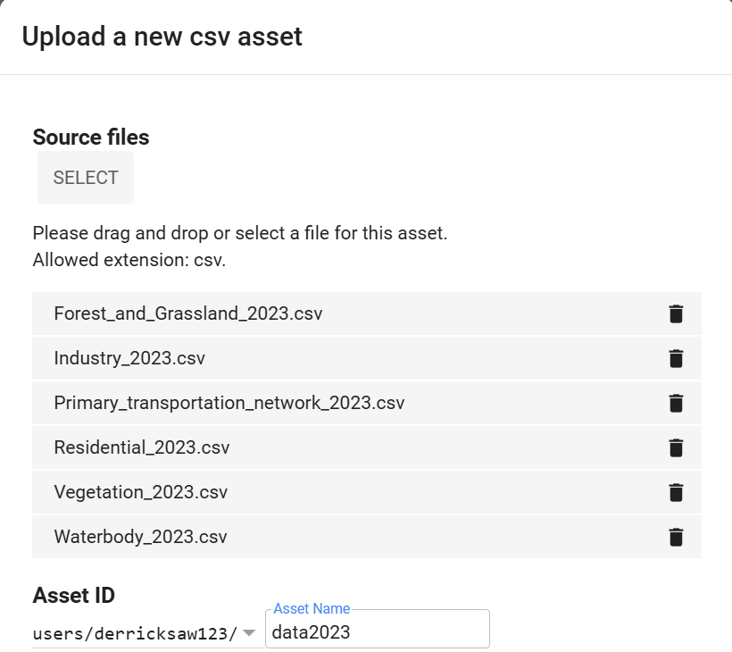

<details open>
<summary><h2>Assignment 1</h2></summary>

### Required packages:
* Plotly
* Numpy
* Geojson

### To install the required packages, use the following command:
```bash
pip install plotly
pip install numpy
pip install geojson
```
</details>

<details open>
<summary><h2>Assignment 2</h2></summary>

### Steps to run the program

1. Register for **Google Earth Engine (GEE)** at [this link](https://signup.earthengine.google.com/#!/no_redirect).
2. Access the **Earth Engine Code Editor** at [this link](https://code.earthengine.google.com/).
3. Download data from the [2018 folder](data/asg2/2018) and [2023 folder](data/asg2/2023).
4. Import the downloaded files in the **Assets > New > Table Upload > CSV file** section as shown in the image below (drag and drop all files of same year at once):
   
5. Modify the import source to your own asset ID. For example:
   ```javascript
   var data2018 = ee.FeatureCollection("users/<YourOwnID>/data2018"),
       data2023 = ee.FeatureCollection("users/<YourOwnID>/data2023");
6. Click **Run** and wait for the results in the console.
</details>